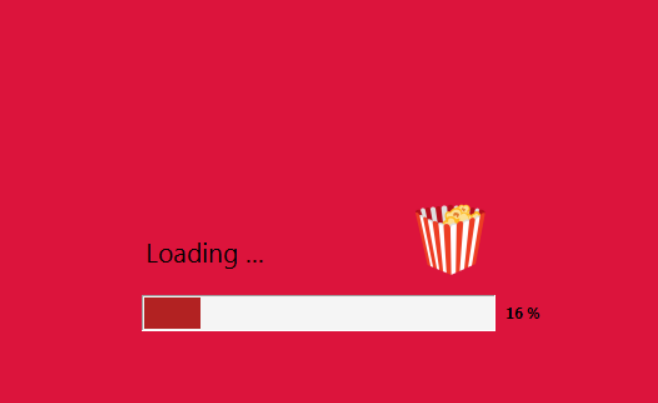
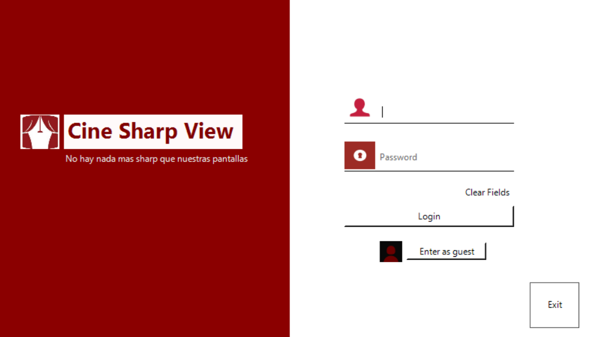
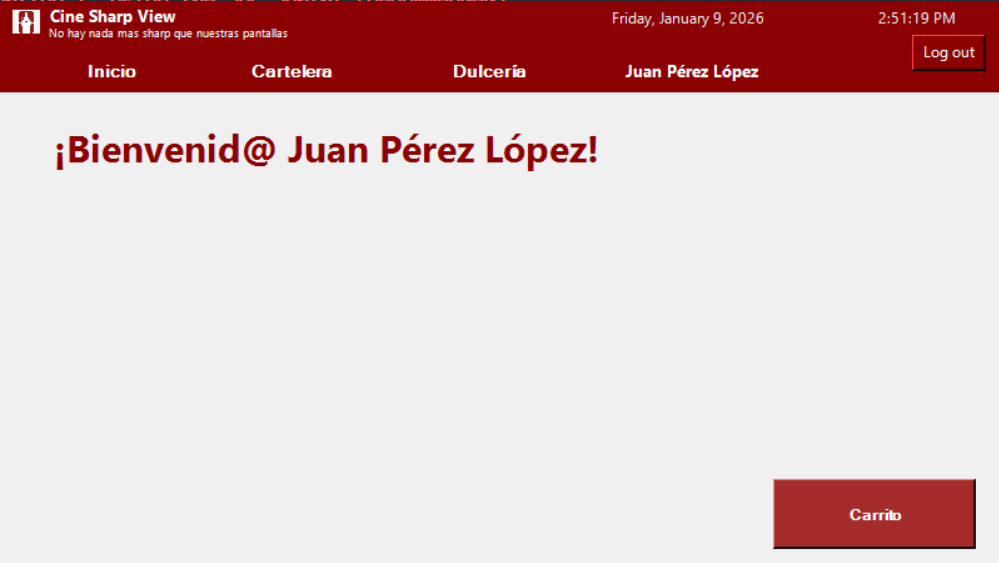
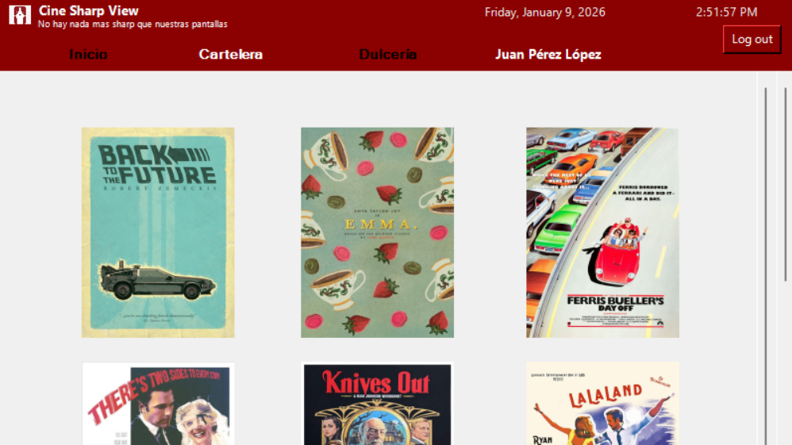
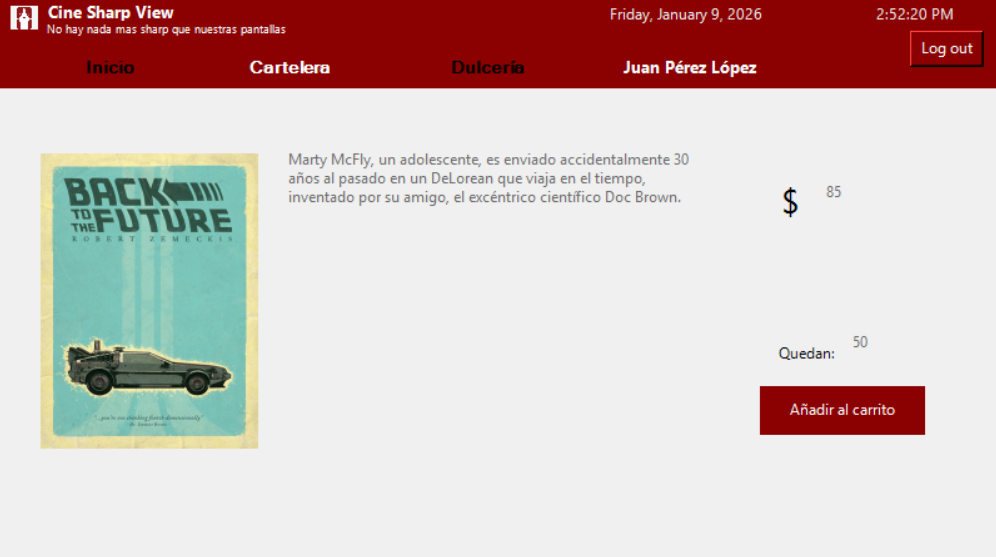
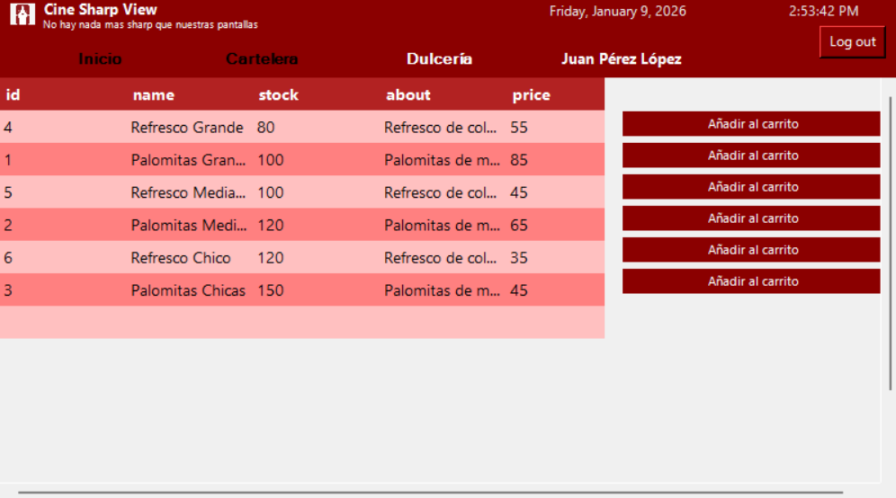
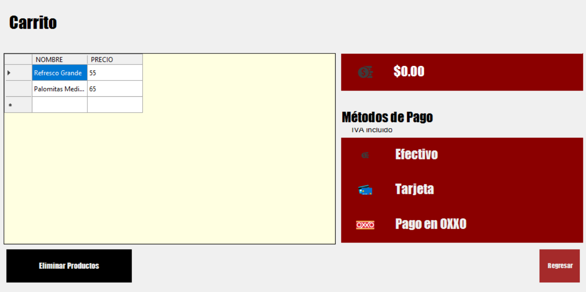
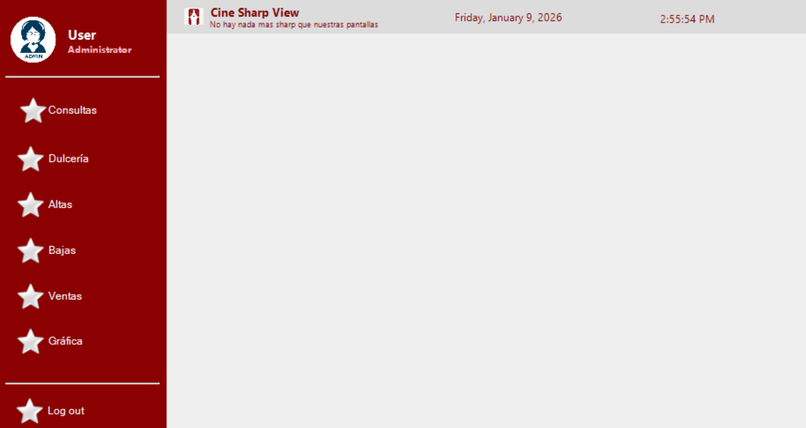
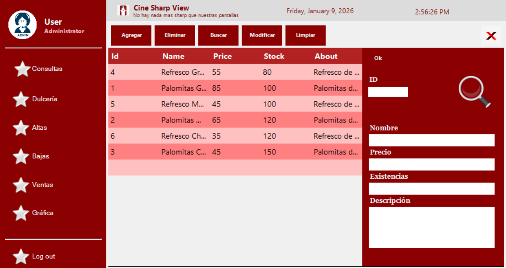
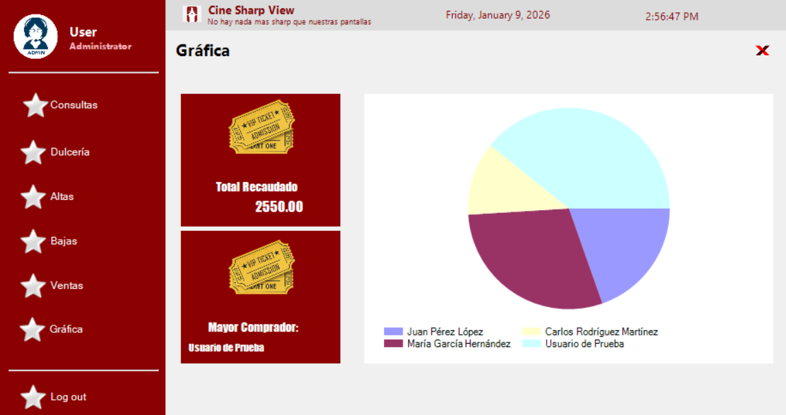

<div align="center">

# 🎬 Cine Sharp View

[](https://dotnet.microsoft.com/)
[](https://docs.microsoft.com/en-us/dotnet/csharp/)
[](https://www.mysql.com/)
[](https://docs.microsoft.com/en-us/dotnet/desktop/winforms/)
[](LICENSE)

**A comprehensive cinema management system with ticket sales, snack bar, and admin dashboard**


</div>

---

## 🎯 About The Project

**Cine Sharp View** is a full-featured desktop application designed to manage cinema operations efficiently. Built with C# and Windows Forms, it provides an intuitive interface for both customers and administrators.

### Why Cine Sharp View?

- 🎫 **Streamlined ticket purchasing** with visual movie selection
- 🍿 **Integrated snack bar** management system
- 📊 **Real-time analytics** and sales reports
- 🔐 **Secure authentication** for users and admins
- 📄 **PDF ticket generation** for purchases

---

## ✨ Features

<table>
<tr>
<td width="50%">

### 👤 Customer Features

- Browse movie catalog with posters
- Purchase tickets for available shows
- Order snacks and beverages
- Shopping cart functionality
- View purchase history
- PDF ticket generation

</td>
<td width="50%">

### 🔧 Admin Features

- Product inventory management
- Add/Edit/Delete movies & snacks
- Sales analytics dashboard
- Visual charts and reports
- User management
- Stock control

</td>
</tr>
</table>

---

## 📸 Demo

<div align="center">

### Loading & Authentication

|           Loading Screen            |           Login Page            |
| :---------------------------------: | :-----------------------------: |
|  |  |

### Main Application

|        Home Dashboard         |           Movie Catalog           |
| :---------------------------: | :-------------------------------: |
|  |  |

### Shopping Experience

|             Movie Details              |             Snack Bar             |         Shopping Cart         |
| :------------------------------------: | :-------------------------------: | :---------------------------: |
|  |  |  |

### Admin Panel

|            Dashboard            |          Products Management          |             Analytics             |
| :-----------------------------: | :-----------------------------------: | :-------------------------------: |
|  |  |  |

</div>

---

## 🚀 Installation

### Prerequisites

Before you begin, ensure you have the following installed:

| Requirement  | Version | Download                                                     |
| ------------ | ------- | ------------------------------------------------------------ |
| .NET SDK     | 6.0+    | [Download](https://dotnet.microsoft.com/download/dotnet/6.0) |
| MySQL Server | 8.0+    | [Download](https://dev.mysql.com/downloads/)                 |
| Git          | Latest  | [Download](https://git-scm.com/)                             |

> 💡 **Tip:** You can use [XAMPP](https://www.apachefriends.org/) or [WAMP](https://www.wampserver.com/) as an alternative MySQL server.

### Quick Start

```bash
# Clone the repository
git clone https://github.com/cesarMalanco/CineSharpView.git

# Navigate to project directory
cd CineSharpView

# Restore NuGet packages
dotnet restore

# Run the application
dotnet run
```

---

## 🗄️ Database Setup

### Option 1: Using the SQL Script (Recommended)

1. Start your MySQL server (XAMPP, WAMP, or standalone)
2. Open phpMyAdmin or MySQL Workbench
3. Import the file `database/cine_database.sql`
4. The script will create the database and populate it with sample data

### Option 2: Manual Setup

<details>
<summary>Click to expand SQL commands</summary>

```sql
-- Create database
CREATE DATABASE IF NOT EXISTS cine;
USE cine;

-- Users table
CREATE TABLE users (
    id INT PRIMARY KEY AUTO_INCREMENT,
    cuenta VARCHAR(50) NOT NULL UNIQUE,
    nombre VARCHAR(100) NOT NULL,
    pword VARCHAR(255) NOT NULL,
    monto FLOAT DEFAULT 0
);

-- Products table (Movies)
CREATE TABLE products (
    id INT PRIMARY KEY AUTO_INCREMENT,
    name VARCHAR(100) NOT NULL,
    img VARCHAR(255),
    about TEXT,
    precio FLOAT NOT NULL,
    stock INT DEFAULT 0
);

-- Sweets table (Snack bar)
CREATE TABLE sweets (
    id INT PRIMARY KEY AUTO_INCREMENT,
    name VARCHAR(100) NOT NULL,
    stock INT DEFAULT 0,
    about TEXT,
    price FLOAT NOT NULL
);

-- Sample user
INSERT INTO users (cuenta, nombre, pword, monto)
VALUES ('admin', 'Administrator', 'admin123', 1000.00);
```

</details>

### Database Connection

The connection string is located in `AdmonDB.cs`:

```csharp
string cadena = "Server=localhost; Database=cine; User=root; Password=; SslMode=none;";
```

> ⚠️ **Note:** Update the password if your MySQL installation requires one.

---

## 💻 Usage

### Running the Application

**Option 1: Command Line**

```bash
dotnet run
```

**Option 2: Visual Studio**

1. Open `WinFormsFinalProyect.sln`
2. Press `F5` or click **Start**

**Option 3: VS Code**

1. Open the project folder
2. Press `Ctrl+F5`

### Default Credentials

| Role  | Username | Password   |
| ----- | -------- | ---------- |
| Admin | `admin`  | `admin123` |
| User  | `test`   | `test`     |

---

## 🛠️ Tech Stack

<div align="center">

|                                                  Technology                                                   |     Purpose      |
| :-----------------------------------------------------------------------------------------------------------: | :--------------: |
|                 | Primary Language |
|              |    Framework     |
|  |   UI Framework   |
|               |     Database     |
|                                   |  PDF Generation  |

</div>

### NuGet Packages

```xml
<PackageReference Include="MySql.Data" Version="9.1.0" />
<PackageReference Include="iTextSharp" Version="5.5.13.4" />
<PackageReference Include="WinForms.DataVisualization" Version="1.9.2" />
```

---

## 📁 Project Structure

```
CineSharpView/
│
├── 📄 Core Files
│   ├── Program.cs                 # Application entry point
│   ├── AdmonDB.cs                 # Database connection & queries
│   └── *.cs                       # Model classes
│
├── 🖼️ Forms/
│   ├── FormLoadingScreen.cs       # Splash screen
│   ├── FormLoginPage.cs           # Authentication
│   ├── FormMainPage.cs            # Main dashboard
│   ├── FormMovies.cs              # Movie catalog
│   ├── FormFood.cs                # Snack bar
│   └── FormMovie[1-7].cs          # Movie details
│
├── 🔧 Admin/
│   ├── Frm_Main.cs                # Admin dashboard
│   ├── Frm_Productos.cs           # Product management
│   ├── Frm_Grafica.cs             # Analytics charts
│   └── Frm_Consultas.cs           # Database queries
│
├── 📂 database/
│   └── cine_database.sql          # Database schema & data
│
├── 📂 Images/                     # Movie posters
├── 📂 Resources/                  # App resources
└── 📂 screenshots/                # Demo screenshots
```

---

## 📝 License

This project is licensed under the MIT License - see the [LICENSE](LICENSE) file for details.

---

## 👤 Author

<div align="center">

**César Malanco**, **Fer Vela** **Danna Castro**, **Darely Quezada** & **Isabel Alvarado**

[](https://github.com/cesarMalanco)

---

<sub>Built with ❤️ using C# and Windows Forms</sub>

</div>
